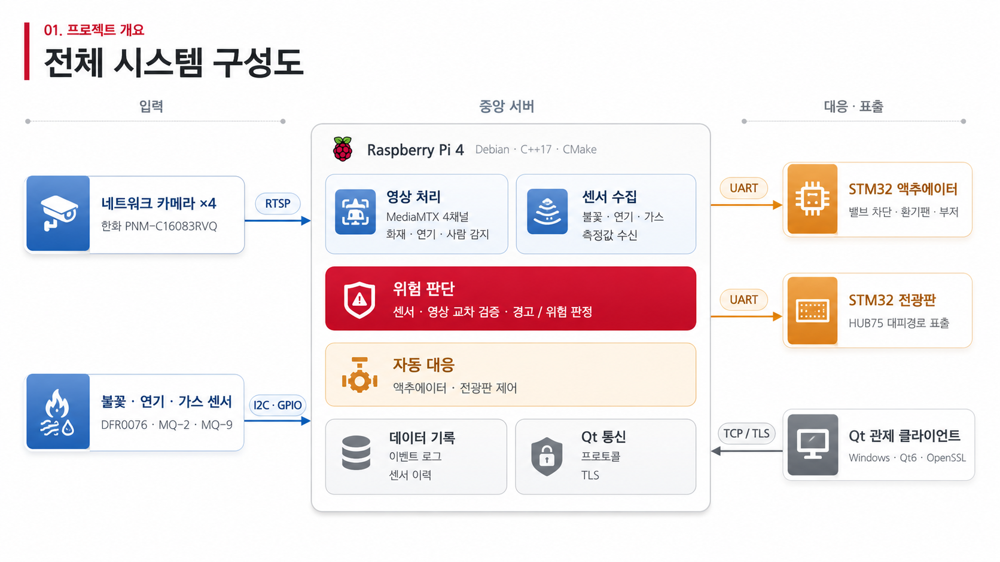
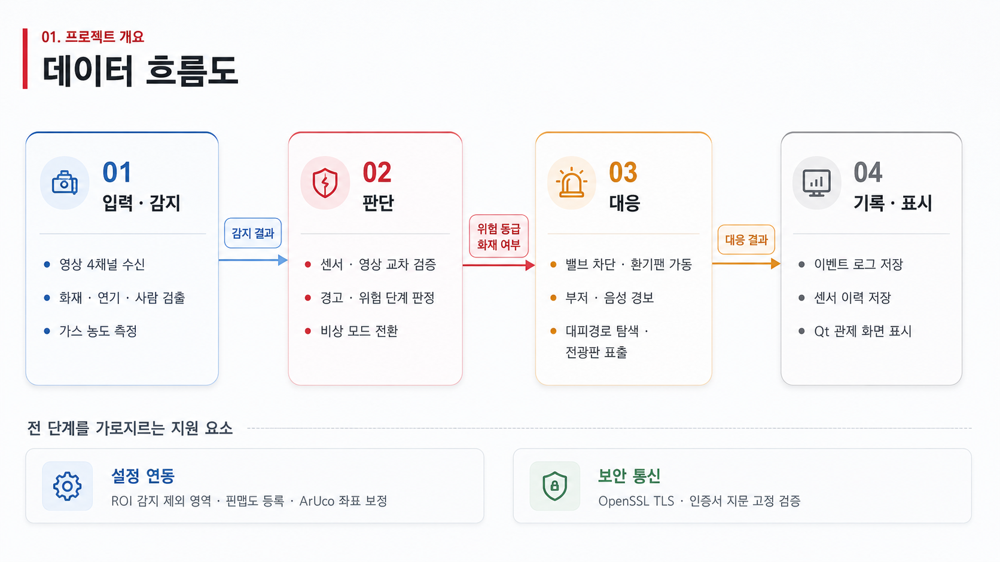

# 🔥 SafeVision — 공장 가스·화재 실시간 감지 및 자동 대응 시스템

카메라 영상과 센서를 **함께** 보고 위험을 판정한 뒤,
**원인에 맞는 대응을 자동으로 실행**하는 통합 관제 시스템

`Raspberry Pi 4` · `C++17` · `OpenCV` · `NCNN` · `STM32` · `Qt6` · `SQLite`

---

## ⚙️ 시스템 구성



- **입력** — 네트워크 카메라 4대(RTSP) · 불꽃 · 연기 · 가스 센서(I2C · GPIO)
- **중앙 서버** — 라즈베리파이 1대가 영상 처리 · 센서 수집 · 위험 판단 · 자동 대응 · 기록을 모두 담당
- **대응·표출** — STM32 보드 2종(UART) · Qt 관제 클라이언트(TCP / TLS)
- 판단을 서버 한 곳에 모아 **보드와 화면은 명령을 받아 실행만** — 판정이 두 곳에서 갈릴 여지를 없앰

---

## 🔄 동작 흐름



- 입력·감지 → 판단 → 대응 → 기록·표시 **4단계 단방향 흐름**
- 단계마다 넘기는 것이 정해져 있음 — 감지 결과 · 위험 등급과 화재 여부 · 대응 결과
- 설정 연동(감지 제외 영역 · 평면도 · 좌표 보정)과 보안 통신은 **전 단계를 가로지르는 지원 요소**

---

## ✨ 주요 기능

### 🎥 감지

| 대상 | 방식 | 주기 |
| --- | --- | --- |
| 화재 | OpenCV 룰 기반 — 색·밝기·움직임·형태 조합 | 채널당 6 fps |
| 연기 | NCNN YOLOv8n — 현장 영상으로 재학습 | 채널당 1 fps |
| 사람 | 카메라 WiseAI 메타데이터 수신 | 실시간 |
| 센서 | 가스(MQ-9) · 연기(MQ-2) · 불꽃(DFR0076) · 온습도(DHT22) | 1초 |

- 720p 4채널을 **라즈베리파이 1대**에서 동시 처리 (분석은 640×360 으로 축소)
- 감지 결과에 ArUco 기준 **공장 좌표(60×60)** 를 붙여 전광판·대피경로와 좌표계 공유
- 감지 제외 영역(ROI) 을 화재·연기에 각각 적용 — 오탐 구역만 선택적으로 차단

### ⚖️ 판단

| 단계 | 진입 조건 | 하는 일 |
| --- | --- | --- |
| 경고 | 영상 단독 · 불꽃센서 단독 (3조합) | 알림 · 기록 · 스냅샷 |
| 위험 | 영상 + 센서 교차 확인 (7조합) | 자동 대응 실행 |
| 비상 | 관리자 수동 전환 | 체크리스트 3항목 만족해야 해제 |

- 영상 단독으로는 위험까지 안 올라감 — 피부·노란 물체를 화염으로 오인할 수 있음
- 경고 상태에서 관리자가 응답하지 않으면 **자동 승격**
- 센서 읽기가 실패해도 값을 0으로 떨어뜨리지 않음 — 고장이 「안전」 신호가 되지 않게

### 🚨 대응

| 원인 | 환기팬 | 밸브 | 사이렌 | 전광판 |
| --- | --- | --- | --- | --- |
| 🔥 화재 계열 | **차단** — 산소 차단 | 차단 | ON | 화재 대피 화면 |
| 💨 가스 계열 | **최대** — 희석·배기 | 차단 | ON | 가스 대피 화면 |
| 해제 | 약 | 개방 | OFF | 평상 화면 |

- 같은 환기팬이 원인에 따라 정반대로 동작 — 「위험이면 환기」로 짰다면 화재를 키움
- 평면도 이미지에서 벽·전광판·출구를 자동 추출해 격자로 변환
- **화재 위치를 장애물로 찍고 다익스트라 재계산** — 불을 통과하지 않는 경로를 전광판에 표시
- 관제 화면에서 밸브·팬·사이렌 수동 조작 가능 (자동 대응과 같은 경로로 실행)

### 📊 기록·관제

| 기록 | 내용 |
| --- | --- |
| 사건 이력 | 경고 → 위험 → 해제를 하나의 **사태**로 묶어 저장 |
| 센서 이력 | 1초 주기 · 조회 시 구간 평균·최댓값으로 집계 |
| 스냅샷 | 경보 시점 프레임 |
| 영상 클립 | 경보 **전 3초 + 후 10초**, 640×360 mp4 자동 저장 |

- 관제 화면 — 실시간 영상 4채널 · 감지 박스 · 농도 그래프 · 이벤트 조회 · 도움말
- 원격 설정 — 감지 제외 영역 · 평면도 등록 · 카메라 좌표 보정을 SSH 없이 화면에서
- TLS 통신 · 인증서 지문 고정 검증

---

## 📁 폴더 구조

| 폴더 | 역할 |
| --- | --- |
| **[`server/`](server/)** | 라즈베리파이 메인 서버 — 감지 · 판단 · 대응 · 기록 |
| **[`qt_client/`](qt_client/)** | 관제 클라이언트 (Windows · Qt6) |
| **[`drivers/`](drivers/)** | 리눅스 커널 드라이버 · UART 프로토콜 |
| **[`dts/`](dts/)** | Device Tree 오버레이 |
| **[`stm32_firmware/`](stm32_firmware/)** | 액추에이터 보드 · 전광판 보드 펌웨어 |

<details>
<summary><b>자세히 보기</b></summary>

```
daehongdan/
├── server/                  라즈베리파이 메인 서버
│   ├── server_main.cpp          초기화 · 스레드 시작
│   ├── control_loop.cpp         판정 → 대응 → 기록 → 전송
│   ├── sensor_worker.cpp        센서 입력 스레드
│   ├── camera_worker.cpp        채널별 영상 입력 · 감지 요청
│   ├── judgement.cpp            판단 매트릭스 · 원인별 대응 정책
│   ├── alarm_state.cpp          경보 단계 · 사태 생명주기
│   ├── qt_link.cpp              관제 화면 송수신
│   │
│   ├── detection/               화재 · 연기 · 사람 감지 코어
│   │   ├── models/                  NCNN 모델
│   │   ├── training/                연기 모델 학습 스크립트
│   │   ├── tools/                   보정 · 디버그 · 테스트 도구
│   │   └── docs/                    좌표 매핑 · CPU 최적화 설계 문서
│   ├── evac_map_tools/          대피경로 계산 (다익스트라)
│   ├── net/                     관제 화면 연결 (평문 / TLS)
│   ├── sensors/                 센서 읽기 · 물리 단위 환산
│   ├── actuator/                밸브 · 환기팬 · 사이렌
│   ├── display/                 전광판
│   ├── audio/                   대피 안내 음성
│   ├── db/                      센서 이력 · 사건 기록 (SQLite)
│   ├── clip/                    이벤트 영상 클립
│   ├── roi/                     감지 제외 영역
│   ├── floormap/                평면도 등록 · 변환
│   ├── calib/                   ArUco 좌표 보정
│   └── streaming/               MediaMTX 영상 재배포 설정
│
├── qt_client/               관제 클라이언트 (Windows · Qt6)
│   └── src/
│       ├── core/                메인 윈도우 · 탭 전환 · 서버 설정
│       ├── pages/               탭별 화면 (모니터링 · 이벤트로그 · 그래프 · 평면도 · 도움말)
│       ├── widgets/             재사용 위젯 (그래프 · 감지 오버레이 · ROI 편집)
│       └── network/             서버 소켓 · RTSP 재생
│
├── drivers/                 리눅스 커널 드라이버 · UART 프로토콜
│   ├── dht22/                   온습도 커널 모듈
│   ├── gas_sensor/              ADS1115 커널 모듈 (가스 · 연기 · 불꽃)
│   ├── stm_uart_actuator/       액추에이터 보드 프로토콜
│   └── stm_uart_display/        전광판 보드 프로토콜
│
├── dts/                     Device Tree 오버레이
│
└── stm32_firmware/          보드 펌웨어
    ├── actuator_board/          밸브 · 팬 · 사이렌 제어
    └── display_board/           HUB75 LED 매트릭스
```

</details>

---

## 🔧 빌드

<details>
<summary><b>서버 (라즈베리파이)</b></summary>

```bash
cmake -S server -B server/build
cmake --build server/build -j4

cd server && stdbuf -oL ./build/server_main
```

MediaMTX 를 먼저 띄워야 합니다 → [server/streaming/](server/streaming/)

</details>

<details>
<summary><b>관제 클라이언트 (Windows)</b></summary>

```bash
cmake -S qt_client -B qt_client/build -G "MinGW Makefiles"
cmake --build qt_client/build
```

</details>

<details>
<summary><b>커널 드라이버</b></summary>

```bash
cd drivers/gas_sensor      # 또는 drivers/dht22
make && make dt-apply && make load
```

</details>

<details>
<summary><b>STM32 펌웨어</b></summary>

STM32CubeIDE 로 열거나 CMake 로 빌드 후 ST-Link 플래싱
→ [stm32_firmware/](stm32_firmware/)

</details>

---

## 💻 개발 환경

| 구분 | 내용 |
| --- | --- |
| 서버 | Raspberry Pi 4 · Debian 11 · C++17 · CMake |
| 영상·감지 | OpenCV 4.5.1 · NCNN (YOLOv8n) |
| 기록 | SQLite3 |
| 통신 | TCP / TLS (OpenSSL) · UART |
| 스트리밍 | MediaMTX |
| 클라이언트 | Qt 6.5+ · MinGW · libvlc |
| 펌웨어 | STM32F4 · CubeMX · HAL |

---

## 📖 문서

| 문서 | 내용 |
| --- | --- |
| [server/](server/) | 서버 구조 · 스레드 구성 · 판정 기준 · 빌드 옵션 |
| [server/detection/](server/detection/) | 화재 · 연기 감지 코어 |
| [drivers/](drivers/) | 드라이버 빌드 · 설치 · 하드웨어 이슈 |
| [qt_client/](qt_client/) | 관제 화면 구성 · 서버 연동 |
| [stm32_firmware/](stm32_firmware/) | 보드 2종 · UART 프로토콜 |
| [server/detection/docs/](server/detection/docs/) | 좌표 매핑 · CPU 최적화 · NCNN 도입 |

---

## 👥 팀

| 이름 | 파트 |
| --- | --- |
| 구대홍 | 서버 통합 · 판단 로직 · DB · 영상 수신 · 대피경로 배선 |
| 김유나 | Qt 관제 클라이언트 · 커널 드라이버 · 센서 |
| 정재환 | 화재 · 연기 감지 코어 · 모델 학습 |
| 김광렬 | 전광판 펌웨어 · 대피경로 알고리즘 · TLS 서버 |
| 장태호 | 액추에이터 펌웨어 · Qt TLS |

**한화 VEDA 4기 최종 프로젝트 · 대홍단감자**
