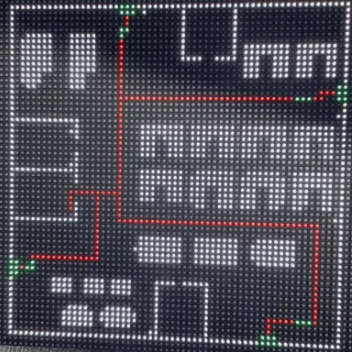
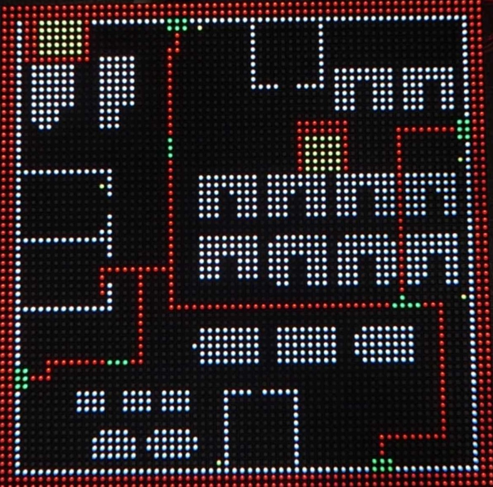

# 🚨 스마트 화재 대피 경로 탐색 알고리즘 (EvacPlanner)

본 모듈은 OpenCV를 활용하여 건물의 평면도 이미지를 분석하고, 실시간 화재 상황을 반영하여 안전한 우회 대피 경로를 동적으로 계산하는 C++ 코어 알고리즘입니다.[cite: 6]
단순한 최단 거리 탐색의 한계를 극복하고, 보행자의 안전과 시스템 통신 무결성을 보장하도록 설계되었습니다.

## ✨ 주요 기능 (Key Features)

### 1. 다익스트라(Dijkstra) 기반 안전 중심 경로 탐색[cite: 6]
* **벽면 이격 (Wall-hugging 방지):** 맵 전체의 벽으로부터의 거리를 사전 계산(Distance Map)하여, 벽에 4칸 이내로 근접할 경우 `(4 - 거리) * 15`의 높은 이동 페널티를 부과합니다.[cite: 6] 이를 통해 통로 중앙의 안전한 동선을 유도합니다.
* **보행 동선 평활화:** 경로 탐색 시 이동 방향이 전환될 때마다 회전 페널티(Turn Penalty: +50)를 적용하여 불필요한 지그재그 꺾임을 최소화하고 직진성 높은 경로를 도출합니다.[cite: 6]

### 2. 실시간 다중 화재 구역 회피 (Dynamic Fire Avoidance)[cite: 6]
* **안전 마진(Margin) 적용:** 비전 센서로부터 수신된 화재 좌표(`FireCell`)와 반경을 바탕으로 상하좌우 **+2칸의 여유 마진**을 둔 임시 장애물(벽)을 동적으로 생성합니다.[cite: 6]
* **다중 화재 대응:** 여러 곳에서 화재가 발생하더라도 모든 화재 구역을 동시에 회피하는 최적의 우회로를 자동 계산합니다.[cite: 6]

### 3. 시스템 인덱싱 보호 (Index Protection)[cite: 6]
* **빈 배열 반환 처리:** 화재로 인해 특정 출구로의 이동이 완전히 차단된(Unreachable) 경우, 해당 경로를 리스트에서 삭제하지 않고 **빈 배열(`{}`)로 반환**합니다.[cite: 6]
* **통신 무결성:** 서버(Qt/DB) 및 하드웨어(STM32) 간의 고정된 전광판-출구 ID 매핑 인덱스가 밀리거나 어긋나는 치명적 시스템 장애를 원천적으로 차단합니다.[cite: 6]

### 4. 하드웨어(STM32) 연동 및 웨이포인트 압축[cite: 6]
* **데이터 최적화:** 연속된 직선 경로는 양끝의 꺾이는 지점(Waypoint)만 남기도록 압축하여 STM32 전송 패킷 크기를 최소화합니다.[cite: 6]
* **C Array 자동 주입:** 계산된 비트맵 맵과 마커 좌표를 C 언어 배열 형태로 직렬화하여 STM32 펌웨어의 `main.c` 파일 내부에 직접 주입(`patchMainC`)합니다.[cite: 6]

---

## 🛠 기술 스택 (Tech Stack)
* **Language:** C++11 이상
* **Library:** OpenCV (이미지 마스킹 및 전광판/출구 마커 자동 추출)[cite: 6]
* **Target Device:** STM32 (UART 통신 기반 LED 매트릭스 전광판)

---

## 📂 출력 파일 및 산출물 (Generated Outputs)
알고리즘 실행 시 실행 파일이 위치한 디렉터리를 기준으로 다음 디버깅 및 연동 파일들이 자동 생성됩니다.[cite: 6]

* `evac_bitmap.txt`: `0`(통행 가능)과 `1`(장애물)로 변환된 최종 62x62 Grid 맵[cite: 6]
* `evac_preview.png`: 추출된 벽면, 전광판(파란색), 출구(초록색) 위치를 시각적으로 확인할 수 있는 컬러 이미지[cite: 6]
* `evac_routes.txt`: 각 전광판별 출구 웨이포인트 및 도달 가능(Reachable) 여부 텍스트[cite: 6]
* `evac_debug_start_[ID].txt`: 화재 위험 구역(`*`), 화재 중심점(`F`), 각 전광판별 대피 경로(`1`)를 직관적으로 확인할 수 있는 디버그 맵[cite: 6]

---

## 🚀 사용 예시 (Usage)

**1. 평상시 경로 계산 (화재 미발생)**
```cpp
// 화재 정보(빈 배열) 없이 호출하여 기본 최적 대피 경로 계산
std::vector<std::vector<Point>> routes = processFloorPlan("map.png", {});

---

## 🖼️ 사진 (Images)

