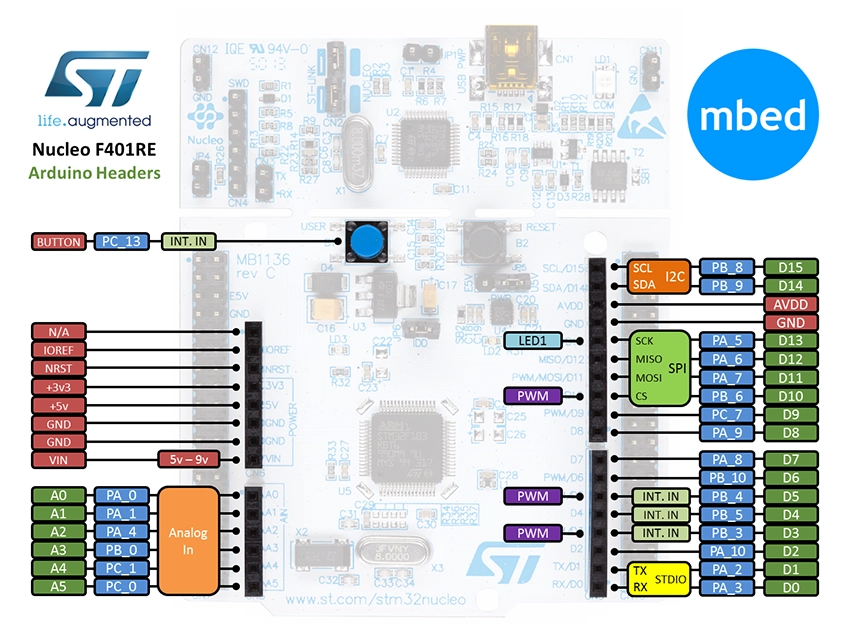
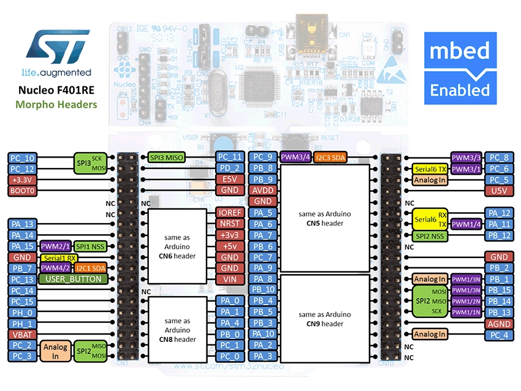
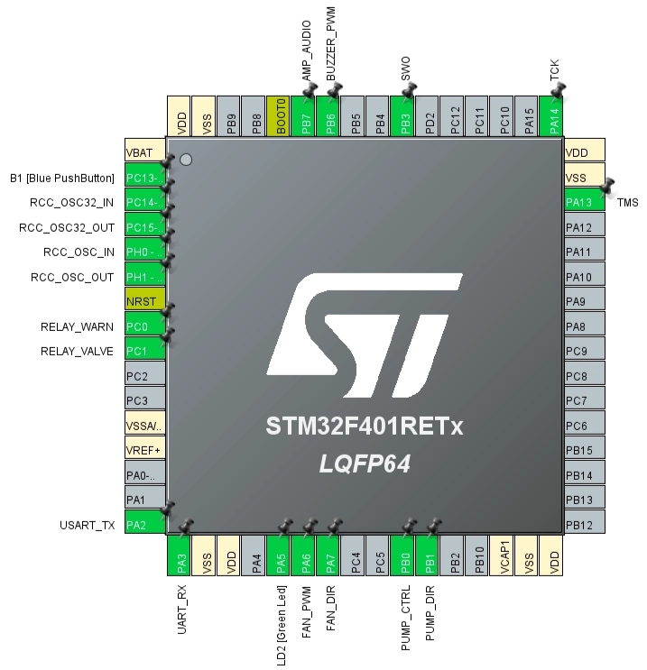
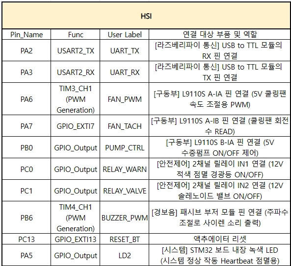
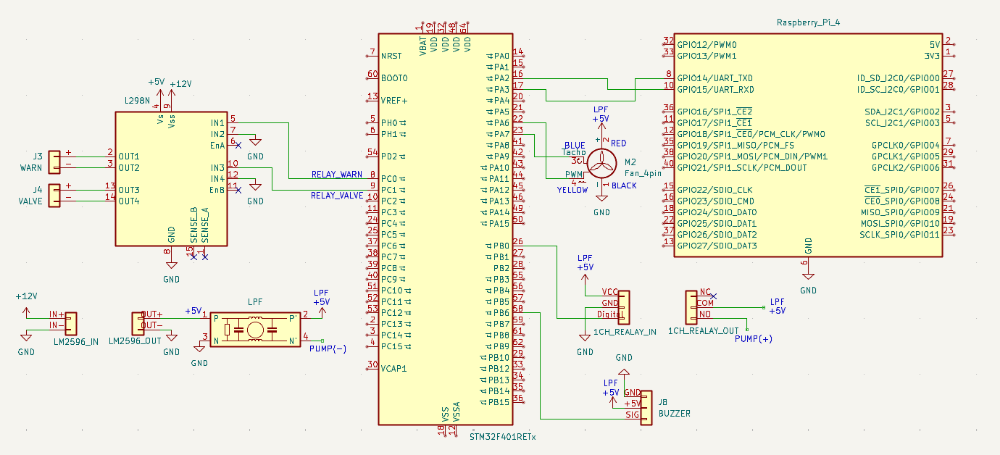

# actuator_board — 액추에이터 보드 펌웨어

## 📌 개요

본 펌웨어는 재난/위험 상황(가스 누출 등) 발생 시 상위 시스템의 판단에 따라 즉각적인 물리적 방어 조치를 수행합니다. 비차단(Non-blocking) 기반의 하드웨어 타이머와 상태 머신(State Machine)을 활용하여 CPU 부하 없이 다수의 액추에이터를 동시에 제어하며, 양방향 상태 동기화를 지원합니다.

---

## ⚙️ 동작

### 제어 대상

* **펌프 및 솔레노이드 밸브 제어:** 1CH 릴레이와 L298N 모터 드라이버를 활용하여 5V 워터 펌프와 12V 솔레노이드 밸브를 신속하고 안정적으로 제어합니다.
* **환기팬 PWM 속도 제어:** 하드웨어 타이머(Timer)를 통해 상황에 맞춰 환기팬의 회전 속도(풍량)를 4단계(OFF/약/중/강)로 가변 조절합니다.
* **경보용 부저(사이렌) 출력:** 패시브 부저에 가변 주파수 PWM 신호를 인가하여 위험 상황 시 즉각적인 사이렌 멜로디를 발생시킵니다.
* **전기적 노이즈 원천 차단 (HW/SW 융합):** 대전류 부하 동작 시 발생하는 전원 출렁임과 역기전력으로 인한 오작동을 하드웨어(LPF 필터) 및 소프트웨어(핀 강제 Lock) 융합 설계로 방어합니다.

---

### UART 프로토콜

Raspberry Pi와 STM32 간의 통신은 가변 길이 패킷 프레이밍 및 XOR 체크섬 검증 방식을 사용합니다.

**패킷 구조**
* **RX (요청):** `[STX(0x02)]` + `[Length]` + `[Command]` + `[Data]` + `[Checksum]` + `[ETX(0x03)]`
* **TX (응답/상태):** `[STX(0x02)]` + `[Length]` + `[Command]` + `[Data(상태값)]` + `[Checksum]` + `[ETX(0x03)]`
> *Checksum 연산: `[Length]` ~ `[Data]` 까지의 XOR 누적 값*

**Command ID**
| Command (HEX) | 명령어 이름 | 설명 | 요청 데이터 (Data) |
| :---: | :--- | :--- | :--- |
| `0x10` | `CMD_FAN_CTRL` | 환기팬 구동 및 속도 제어 | `0x00`(OFF), `0x01`(약), `0x02`(중), `0x03`(강) |
| `0x20` | `CMD_VALVE_CTRL` | 솔레노이드 가스 밸브 제어 | `0x00`(닫힘), `0x01`(열림) |
| `0x30` | `CMD_SIREN_CTRL` | 사이렌 및 부저 제어 | `0x00`(OFF), `0x01`(ON) |
| `0x40` | `CMD_REQ_STATUS` | 액추에이터 현재 상태 요청 | No Data (응답 시 3Byte 상태값 회신) |
| `0x50` | `CMD_GAS_EMERG` | [가스 누출] 사이렌 ON, 밸브 차단, 환기팬(강) | No Data |
| `0x60` | `CMD_MAX_EMERG` | [최고 비상] 사이렌 ON, 밸브 차단, 환기팬 OFF | No Data |
| `0x70` | `CMD_SYS_RESET` | [상황 해제] 사이렌 OFF, 밸브 오픈, 환기팬(약) | No Data |

---

### 핀 배치





### 하드웨어·소프트웨어 인터페이스



### 회로도



---

## 📁 주요 파일

| 파일 | 역할 |
| --- | --- |
| `Core/Src/main.c` | 진입점 · UART 수신 · 명령 처리 · 상태 머신 |
| `Core/Inc/main.h` | 핀 정의 · 핸들 |
| `FactorySafety.ioc` | CubeMX 설정 원본 — 핀 배치 · 클럭 · 타이머 |
| `Drivers/` | ST HAL · CMSIS (벤더 제공, 수정 안 함) |

---

## 🔧 빌드·실행

```bash
cmake -S stm32_firmware/actuator_board -B build && cmake --build build
```

플래싱은 ST-Link 로 합니다.

> ⚠️ CubeMX 로 코드를 재생성하면 `USER CODE BEGIN` ~ `END` 구간 밖은 사라집니다.

---

## 🛠 문제 해결

1. **LC 전원 필터(LPF) 및 그라운드 바운스 방어**
   * **이슈:** 펌프 기동 시 돌입 전류에 의한 5V 메인 전원 출렁임으로 부저 오작동 발생(안테나 효과).
   * **해결:** 펌프 전원 입력단에 LPF(Low Pass Filter)를 설계하여 전자기 노이즈 경로를 물리적으로 격리하고, 부저 OFF 시 `GPIO_PIN_RESET` 상태로 핀을 0V에 강제 고정하는 소프트웨어 Lock을 구현하여 오작동을 완벽히 차단했습니다.

---

## 🔗 참고

- 호스트 쪽 프로토콜 — [drivers/README.md](../../drivers/README.md)
- 서버 연동 — [server/actuator/README.md](../../server/actuator/README.md)
- 상위 개요 — [stm32_firmware/README.md](../README.md)
